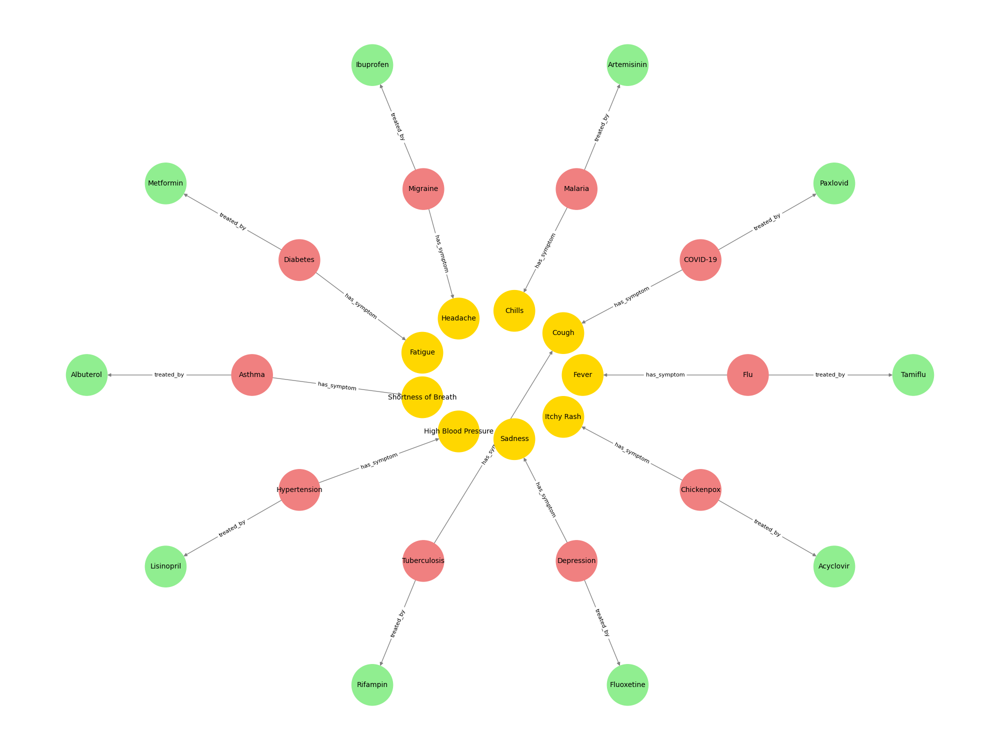

# DiseaseMedGraph
A knowledge graph visualizing diseases, symptoms, and treatments using Python.

# DiseaseMedGraph 🦠💊

This project visualizes relationships between diseases, symptoms, and treatments using a knowledge graph.

## 📁 Dataset
A custom dataset of 10 common diseases with their associated symptoms and medicines, saved in `disease_data.csv`.

## 🧠 What It Does
- Converts disease/symptom/medicine data into knowledge graph triples
- Builds and visualizes a directed graph
- Categorizes node types (Disease, Symptom, Medicine)
- Labels edges (`has_symptom`, `treated_with`)

## 📊 Output

## 📚 Tools Used
- Python
- NetworkX
- Matplotlib
- Pandas

## 💡 Inspired by
The AI Summer Challenge by Code with Serah, OSSPrint, GDG On Campus – FS1, and Near East University AI Club.
